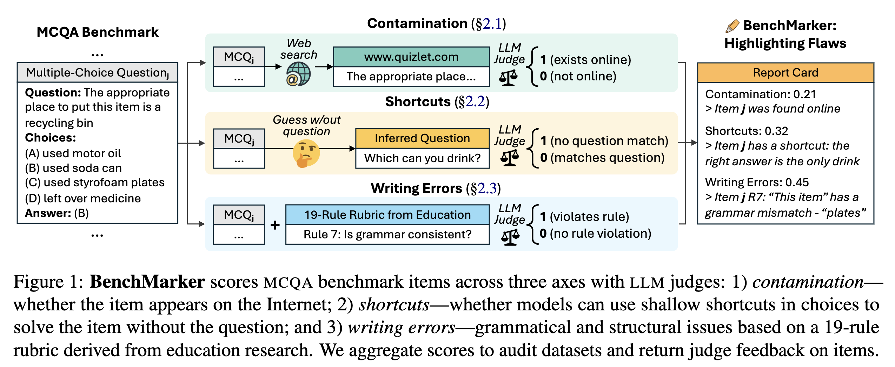
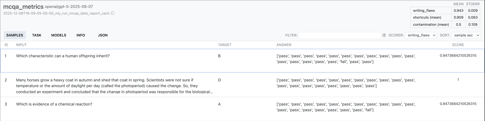

This repository is the official implementation of the paper **BenchMarker: An Education-Inspired Toolkit for Highlighting Flaws in Multiple-Choice Benchmarks**.



We provide our code for detecting flaws in MCQA benchmarks and logic to rewrite multiple-choice questions

## Table of Contents

- [Installation](#installation)
- [Quick Start](#quick-start)
- [Parameters](#parameters)
- [Project Structure](#project-structure)
- [Citation](#citation)

## Installation

Our reporsitory requires Python 3.11 and can be clonsed as follows:

```bash
git clone <repository-url>
cd BenchMarker
```

Requirements are in `pyproject.toml`, which we recommend installing using `uv`:

```bash
uv pip install .
```

Afterwards, rename `.env.example` to `.env` and set the API keys you want to use as environment variables:
- For LLMs, we support LLM API keys from LiteLLM
- If you want to run web search, we support: Google, Perplexity, Brave, Tavily, Serper, or Exa API keys

## Quick Start: Main Entry Points

Below, we discuss the main entry points for BenchMarker: scoring multiple-choice benchmarks, validating LLM judges, running item response theory, and rewriting multiple-choice questions

### 1. Scoring Multiple-Choice Benchmarks

To score a new dataset with BenchMarker, first load your dataset as either a CSV, JSONL, or Huggingface dataset with three columns:
- `question`: the question stem
- `choices`: a list of string choices
- `answer`: a capital letter (e.g., A, B, C, D) that corresponds to the correct answer in `choices`

We have example datasets in each format stored in [ARC](https://arxiv.org/abs/1803.05457) in `example_datasets/ARC*`

Afterwards, run this script to score the dataset and obtain accuracy scores:

```
uv run python clip.py --steps metrics --dataset [path-to-dataset]
```

There are several configrable parameters in the `config/*` folder, described in the [Parameters](#parameters) section of the README later


### 2. Validating LLM Judges

We provide our scripts for validating our LLM judge scorers in `judge_experiments/`

In `judge_experiments/judge_scripts/*`, we provide three main entry points:
- `contamination.sh`: Validating the contamination scorer
- `shortcuts.sh`: Validating the shortcuts scorer
- `writing_flaws.sh`: Validating the writing flaws scorer

Each script provides more details on which parameters are configurable. The `judge_experiments/validation_data/*` folders contains our human-annotated validation data

### 3. Item Response Theory Evaluation 

In the paper, we mainly use accuracy to evaluate models and estimate dataset difficulty, but [Item Response Theory](https://www.taylorfrancis.com/books/mono/10.4324/9780203056615/applications-item-response-theory-practical-testing-problems-lord) is another principled approach from educational testing that we support

To run item response theory, you need to define the LLMs that you want to use as simulated test-takers, first estimating their skills:

```
uv run python cli.py --steps skills
```

Afterwards, you can run the metrics script as normal, and BenchMarker will report:
- `difficulty`: how hard the item was, learned from the abilities of models that were evaluated
- `discriminability`: how well the item separates low-skill and high-skill models
- `avg_accuracy`: the average accuracy of models (same as before)


### 4. Rewriting Multiple-Choice Questions

We also support preliminary investigations into rewriting multiple-choice questions:

```
uv run python cli.py --steps refine
```

This script allows you to use LLMs to fix the flaws detected previously, add new distractors to the question, or raise the question difficulty based on [Bloom's Taxonomy](https://en.wikipedia.org/wiki/Bloom%27s_taxonomy)

Our initial attempts in the paper found this process was unreliable, so we're currently looking at ways to improve it. Stay tuned!

### Extra: Local UI to Track Runs

One of the main reasons I wanted to use InspectAI is because it has a local UI to track experimental runs, which is so awesome. You can launch it as follows:

```
uv run inspect view
```

This will open up a local URL (by default, [http://127.0.0.1:7575](http://127.0.0.1:7575)) where you can view your runs. Here's what it looks like for a run I did where I tracked writing flaws:



## Parameters

The easiest way to set parameters for computing model skills, scoring multiple-choice benchmarks, and rewriting them is the `/config/` folder:
- `base.yaml`: Applies to all three scripts
- `skills.yaml`: Applies to the LLM skill measurements for IRT
- `metrics.yaml`: Applies to the benchmark scoring scripts
- `refine.yaml`: Applies to the MCQ rewriting scripts

All parameters can also be overridden via CLI arguments

### Base parameters (requires no prefix for `--` override)

| Parameter | Description |
|-----------|-------------|
| --dataset | Path to your dataset |
| --metrics | Comma-separated metrics to compute: writing_flaws, shortcuts, contamination, difficulty |
| --cache_dir | Cache directory |
| --dataset_save_dir | Where to save refined datasets |
| --plot_dir | Where to save plots |
| --cache_type | Whether to cache results for repeat runs (none \| cache \| overwrite) |
| --skill_run_name | Run name for the skills step |
| --metric_run_name | Run name for the metrics step |
| --refine_run_name | Run name for the refine step |

### Skills (requires `skills.` prefix for `--` override)

| Parameter | Description |
|-----------|-------------|
| --skills.num_samples | Number of samples to use for skills evaluation |
| --skills.skill_datasets | Comma-separated paths to datasets to estimate skills |
| --skills.difficulty.models | LLMs used to estimate skills |
| --skills.difficulty.irt_model.* | Same IRT options as metrics.difficulty (see below) |

### Metrics (requires `metrics.` prefix for `--` override)

| Parameter | Description |
|-----------|-------------|
| --metrics.num_samples | Number of samples for evaluation (null = all) |
| --metrics.difficulty.models | Comma-separated model IDs to use for difficulty/IRT estimates |
| --metrics.difficulty.irt_model.num_draws | IRT MCMC draws |
| --metrics.difficulty.irt_model.num_tune | IRT tune steps |
| --metrics.difficulty.irt_model.chains | IRT chains |
| --metrics.difficulty.irt_model.cores | IRT cores |
| --metrics.shortcuts.model | LLM judge used for shortcuts |
| --metrics.contamination.model | LLM judge used for contamination |
| --metrics.contamination.search_type | Search engine type to use (google \| perplexity \| brave) |
| --metrics.contamination.use_llm | Whether to use an LLM to detect contamination or just rely on web page existence (--use_llm flag) |
| --metrics.writing_flaws.model | LLM used for writing flaws judge |

### Refine (requires `refine.` prefix for `--` override)

| Parameter | Description |
|-----------|-------------|
| --refine.difficulty.type | Whether to do any filtering based on LLM scores to make your dataset, efficient, less staurated, more informative (efficiency \| saturation \| informative \| none) |
| --refine.difficulty.min_discrimination | For filtering via discriminativeness, the proportion or count of items to keep |
| --refine.difficulty.efficiency.max_size | For filtering via efficiency, the proportion or count of items to keep |
| --refine.difficulty.informative.max_size | For filtering via informativeness, the proportion or count of items to keep |
| --refine.difficulty.saturation.max_size | For filtering via saturation (hardest items), the proportion or count of items to keep |
| --refine.shortcuts.type | filter \| rewrite \| none |
| --refine.shortcuts.model | LiteLLM model used for rewriting |
| --refine.contamination.type | Whether to filter, rewrite, or do nothing for contamination (filter \| rewrite \| none) |
| --refine.contamination.model | LiteLLM model used for rewriting |
| --refine.writing_flaws.type | Whether to filter, rewrite, or do nothing for writing flaws (filter \| rewrite \| none) |
| --refine.writing_flaws.model | LiteLLM model used for rewriting |
| --refine.num_distractors | How many distractors to add to the multiple-choice question |
| --refine.num_blooms_levels | How many bloom levels to raise the question by (to heighten difficulty) |


## Project Structure

```
BenchMarker/
├── cli.py                     # Entry point: --steps skills,metrics,refine
├── config/                    # YAML config (base, metrics, refine, skills)
│   ├── base.yaml
│   ├── metrics.yaml
│   ├── refine.yaml
│   └── skills.yaml
├── endpoints/                 # Step runners
│   ├── run_metrics.py         # Difficulty, shortcuts, contamination, writing_flaws
│   ├── run_refine.py         # Filter/rewrite by metric
│   └── run_skills.py         # Skills evaluation
├── scorers/                   # Per-metric scoring
│   ├── difficulty_scorer.py  
│   ├── shortcut_scorer.py
│   ├── contamination_scorer.py
│   └── writing_flaws_scorer.py
├── prompts/                   # Prompt templates (shortcuts, contamination, writing flaws)
├── data_utils/                # Load, merge, refine, save datasets
├── model_utils/               # IRT, web search
├── judge_experiments/         # Judge model + prompts + validation data
├── utils/                     # Config merge, cache, enums
├── scripts/
│   ├── PARAMS.md              # Full parameter docs and examples
│   ├── run_metrics.sh
│   ├── run_refine.sh
│   └── run_skills.sh
├── example_datasets/            # Example datasets for ARC
├── pyproject.toml
└── README.md
```

## Citation

If you find our paper on BenchMarker useful, we would appreciate it if you cite our paper!

```bibtex
@article{balepur2026benchmarker,
  title={BenchMarker: An Education-Inspired Toolkit for Highlighting Flaws in Multiple-Choice Benchmarks},
  author={Balepur, Nishant and Rajasekaran, Bhavya and Oh, Jane and Xie, Michael and Desai, Atrey and Gupta, Vipul and Moore, Steven James and Choi, Eunsol and Rudinger, Rachel and Boyd-Graber, Jordan Lee},
  journal={arXiv preprint arXiv:2602.06221},
  year={2026}
}
```

## Contact

For questions or issues, please open an issue on the repository or contact me at [nbalepur@umd.edu](mailto:nbalepur@umd.edu)
